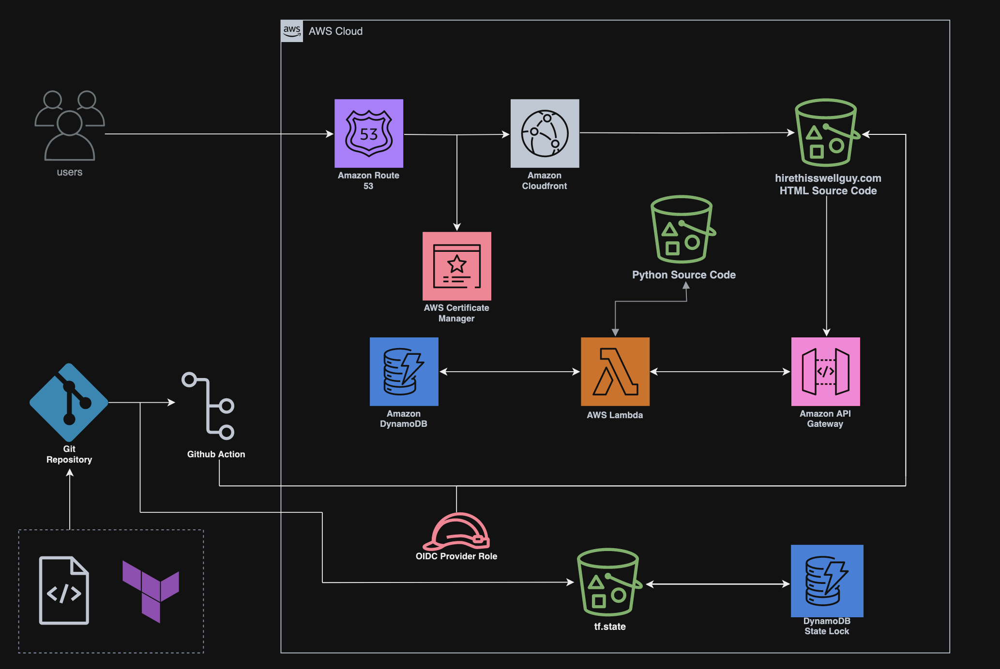

# Cloud Resume

The most important aspect of your resume is experience. What have you accomplished and what value do you bring to the team? This is what potential employers want to know. The best way to obtain experience is on the job. But what if you are trying to break into a new career and you aren't able to demonstrate relevant skills from your last job? You need to show them off somehow and a project is a great way to do that. This is where I found myself and why I created a Cloud Resume.

On the surface it is a simple website that hosts the content of my resume. But if you look at the code in this repo, you'll notice the complexity that lies underneath. My Cloud Resume is a serverless web application hosted in AWS. The processes running in the backend are automated with services like Lambda and GitHub Actions while the infrastructure is managed with Terraform. Once the application is stood up it essentially runs itself. However, getting there was quite the journey. Countless hours of troubleshooting, reading documentation, and scouring stack exchange for answers. It was all worth it in the end because doing is the best way to learn. Certs are helpful for getting a foot in the door, but having projects to showcase your competency are far more effective.

## Architecture of the Web Application

## Frontend 

### HTML/CSS/Javascript

 The webite content is made up of HTML, CSS, and Javascript. I pulled the HTML and CSS files from a template and modified them as needed. This allowed me to learn the basics without having to spend weeks learning both languages and build the website from scratch. My interests lie in backend infrastructure and that was where I wanted to focus my attention. I did need to learn a bit of Javascript to integrate the visitor counter with the backend API.

### Static Web Hosting - AWS S3

The web files were stored in an Amazon S3 bucket originally configured to host a static website. After reviewing the security posture of the project, I decided to take another approach that is explained in detail in the Security Considerations section. The website hosting configuration was removed in order to implement Origin Access Control and make the S3 bucket private. A second subdomain S3 bucket was also created with a 'www.' prefix so it can be redirected in the browser. The HTML/CSS/Javascript files were uploaded to the bucket and the website was effectively up and running, although much more work was needed.

## Backend

### Securing Web Traffic - Route53, CloudFront, HTTPS, and DNS

First, I created a Route 53 hosted zone and purchased my domain. From there I designated my domain S3 bucket to be the origin sitting behind a Cloudront distribution. The distribution was configured to redirect any unsecured requests to HTTPS and forward any requests from the subdomain to the primary domain. I also set CloudFront to direct any requests made to my domain or subdomain to the distribution. This involved using AWS Certificate Manager to create a certificate, associating it with the distribution, and validating it via CNAME Records in Route53. Now anyone visiting mywebsite would be directed to the CloudFront distribution via Route53 and served the content hosted in my S3 bucket over a secure connection. 

### Lambda Function and Database Integration

The next stage was to create a visitor counter to track how many people are viewing the website. I started by setting up a DynamoDB table with one item; a view count and coresponding value. Updating the value in the table was best suited with a lambda function. I wrote a python script using the Boto3 library to increment the view count item by one every time it was triggered and return that new value. The python script and coresponding zip file are stored in a dedicated S3 bucket from which lambda can exclusively access them. The lambda function is triggered by an HTTP API that I created in API Gateway and integrated into the websites javascript file. The result is that when a client visits the website the javascript code will make an API call to APIGateway, trigger the lambda function, update the Dynamodb table item by one, and return the new value on the webpage.

## Infrastructure as Code: Terraform

I created most of my AWS infrastructure via Terraform resources from the start since I already had exposure to HCL. While frustrating at times, this was a valuable learning experience. A lot of time was spent reading the Terraform documentation and determing why certain resources were not deploying correctly. Sometimes I even had to create them from the AWS Console and work backwards to see what the differences were between my HCL code and the resource configurations. This was partricularly useful for creating resources in API Gateway. My exposure to APIs at the time was limited and building one from HLC was a challenge for me. I learned some useful skills from this process, including referencing Terraform resources in one state from another, utilizing the "depends_on" feature to avoid build errors, importing resources into Terraform, and how to secure the tf.state file with S3 and DynamoDB.

## Automation

### CI/CD: Github Action

I wanted to automate the deployment of any changes made to the frontend of my webapp. Github actions was the most obvious solution as I was already using a Github repository for source control. The action script is triggered when a pull request submitted to the repository. It runs several Terraform commands and then outputs the Terraform plan as a comment in the pull request. Once the plan is reviewed and merged to main, Terraform applys the configuration and the website files are updated.

### Cloudfront Invalidation via Lambda

A drawback of the frontend CI/CD workflow was the Cloudfront distrubtion would not automatically reflect the changes made to my website. Since the TTL of my distribution was 7 days, I needed to manually invalidate the Cloudfront cache in order to show the updated content. I resolved this by creating another lambda function. A python script utilizes the Boto3 library to immediately invalidate the CloudFront distrubution when invoked. Any update to the index.html file in the domain S3 bucket will trigger the invalidation function.

## Security Considerations:

### Granting Github Actions Access to the AWS Account

While integrating CI/CD via Github Actions, I needed to determine a method for the action to authenticate with my AWS account. The most obvious solution was to import my AWS Access Key ID and Secret Access Key into the Github repo as a secret. After all, [GitHub Action secrets are encrypted](https://docs.github.com/en/actions/security-guides/using-secrets-in-github-actions) and theoretically should be safe. Regardless, I was wary of committing the 'keys to the kingdom' to a 3rd party. And I figured most enterprises would have similar reservations and search for a more secure solution. I looked at other options such as [integrating the action with Terraform Cloud](https://developer.hashicorp.com/terraform/tutorials/automation/github-actions) (now called HCP Terraform). It seemed simple enough, but again I found myself required to submit my AWS credentials as environment variables to a 3rd party. Eventually, I learned that OpenID Connect can be used to authenticate the Github Action with my AWS account. This was my ideal solution for two reasons. First, there is no need to submit AWS credentials as long lived secrets in a 3rd party platform. Trust is established between the Github Action and AWS via an OIDC provider. This allows the action to request a temporary access token to complete it's function and discard it at completion. Additionally, this method allowed for the implemention of an IAM role with granular access to the specific resources the action needs to access. This was ideal since I wanted to limit access to only the neceassary resources and follow best practices with RBAC. That being said, it did lead to some issues downstream that I addressed in the next section.

### Terraform State Management and Least Privledge

Originally, the entire application was managed under one Terraform state file. This wasn't an issue until OIDC authorization and RBAC were implemented. I noticed that my Github Action was failing everytime I triggered it. The Terraform error logs revealed that the IAM role needed get/read/list/etc permissions to every single resource... and there were a lot of them. RBAC best practices suggested that the action should only require access to the minimum resources it needs to read and modify.  I determined the best way to accomplish this was to separate the Terraform state based on the frontend and backend resources. The action only needs to update the frontend and the backend won't change much once the infrastructure has been built. This also caused me to consider what would happen if the "terraform destroy" command was run. The entire application would be deleted if managed by a single state file. Splitting the state enabled my to implement least privledge on the OIDC role and protect the frontend and backend resources from inadvertantly destoying each other.

### Origin Access Control

The domain S3 bucket was configured to be public per the AWS requirements for a website endpoint. However, I knew it was recommended to block public access to S3 buckets per AWS security best practices. In addition, a significant increase in requests to the bucket could result in a large AWS bill. While Cloudfront was serving the content, someone could theoretically figure out the bucket name, spam requests to the bucket, and run up charges in my account. Fortunately, this is no longer an issue since [AWS recently eliminated charges for 403 Forbidden request errors](https://aws.amazon.com/about-aws/whats-new/2024/05/amazon-s3-no-charge-http-error-codes/). Restricting bucket access to the cloudfront distribution would resove these security concerns, so I created an Origin Access Control configuration for the cloudfront distribution. This invovled quite a few steps. First, I learned via the [AWS documentation](https://repost.aws/knowledge-center/cloudfront-serve-static-website) that you can utilize the S3 REST API to serve a static website without making the bucket public. I removed the S3 website configuration block from my s3.tf file ([per the requirements](https://docs.aws.amazon.com/AmazonCloudFront/latest/DeveloperGuide/private-content-restricting-access-to-s3.html)) and replaced it with an S3 block public bucket access resource and an S3 bucket policy restricting access to the Cloudfront distribution id. Then I created the OAC resource in the cloudfront.tf file and added the "origin_access_control_id" parameter to the origin block for the distribution. The deployment failed initially because AWS provider version 4.4.0 does not support OAC resources, so I updated it to version 5.57.0. With the new configuration applied, the domain bucket and contents were now private and least privilege was implemented via the bucket policy restricting access to CloudFront.
  